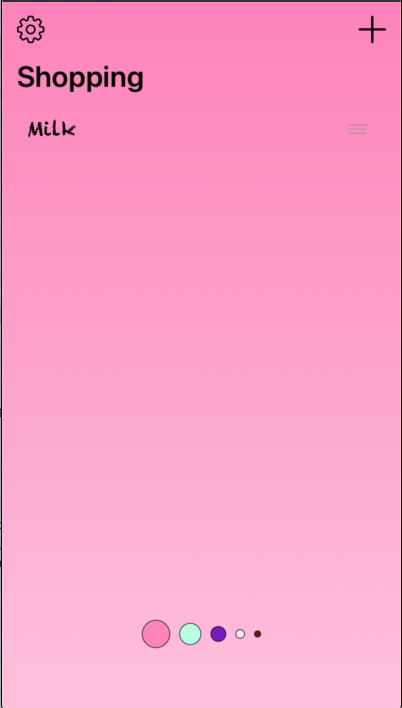
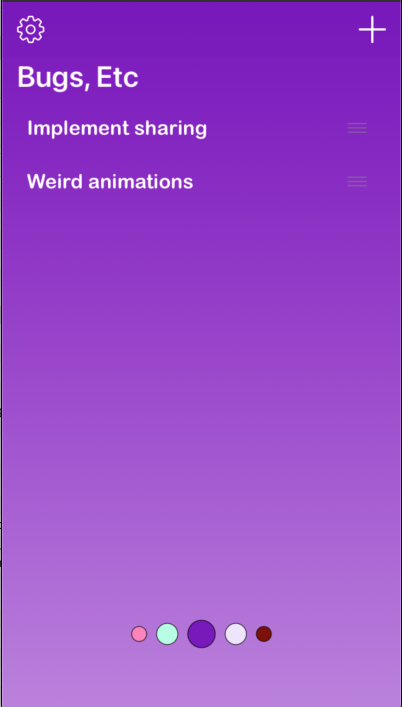

# PagingControl

An attractive page control component which can be used with any paging model which conforms to the PagingViewModel protocol.

 

## Installation

### Swift Package Manager

In Xcode:
* File ⭢ Swift Packages ⭢ Add Package Dependency...
* Use the URL https://github.com/franklynw/PagingControl


## Example

> **NB:** All examples require `import PagingControl` at the top of the source file

Conform to the PagingViewModel protocol -

```swift
class MyPagingViewModel: ObservableObject, PagingViewModel {
    
    // This is just a convenient (lightweight) way of keeping the pages for the control
    struct PagingControlColor: PageableItem {
        let id: String
        let pageIndex: Int
        let backgroundColor: UIColor
        let borderColor: UIColor
    }
    
    // Requirements of PagingViewModel -
    
    typealias PagingItem = PagingControlColor
    
    // These don't have to be @Published, but the control won't pick up on changes if they're not
    @Published var pagingControlColors: [PagingControlColor] = []
    @Published var currentPage: Int = 0 {
        didSet {
            // dragging or tapping on the control updates this value here - do page changing stuff
        }
    }
    
    // etc...
```

...and use it in your view -

```swift
var body: some View {

    ZStack {
    
        // This component is a SwiftUIPager (see link at foot of page) but you could easily make your own
        Pager(page: viewModel.pageIndex, data: pageViewModels) {
            return PageView(viewModel: $0)
        }
        .animation(.linear)
        .edgesIgnoringSafeArea(.all)
    
        // The PagingControl component is placed at the top of a ZStack, usually quite close to the foot of the screen
        VStack(alignment: .center) {
            Spacer()
            PagingControl(viewModel)
                .minDiameter(5)
                .maxItems(7)
                .padding(EdgeInsets(top: 0, leading: 0, bottom: 50, trailing: 0))
        }
    }
}
```

There are various customisation options -

### Minimum circle diameter

Sets the minimum diameter which the circles can get to. If not used, the circles will get smaller until they disappear

```swift
PagingControl(viewModel)
    .minDiameter(5)
```

### Maximum circle diameter

Sets the maximum diameter which the circles can get to. If not used, the value defaults to 22 pixels

```swift
PagingControl(viewModel)
    .maxDiameter(30)
```

### Maximum number of circles

Sets the maximum number of circles which the control will show. Any additional pages won't show in the control until to pan to them. Defaults to unlimited

```swift
PagingControl(viewModel)
    .maxItems(7)
```

### Circle size tail-off

Controls how quickly the sizes of the circles reduce for those which aren't the current page. Defaults to .medium

```swift
PagingControl(viewModel)
    .sizeTailOff(.low)
```

### Circle magnification

Controls how much the circles magnify when you drag across the control. Defaults to .medium

```swift
PagingControl(viewModel)
    .magnification(.custom(4))
```

### The SizeTailOff and Magnification enums

These control the circle size tailing-off and magnification. The cases are -

* .max                            - size tails off quickly
* .medium                      - size tails off at a medium rate, good for most uses
* .low                             - size tails off slowly
* .none                           - size doesn't tail off (all circles are the same size)
* .custom(CGFloat)        - lets you specify your own rate

The magnification options are identical


### SwiftUIPager

The component which inspired me to write this control is the SwiftUIPager, which can be found [here](https://github.com/fermoya/SwiftUIPager) - this is a great (in my view, much better than Apple's) implementation of Paging, and it works perfectly with PagingControl


## Licence  

`PagingControl` is available under the MIT licence
